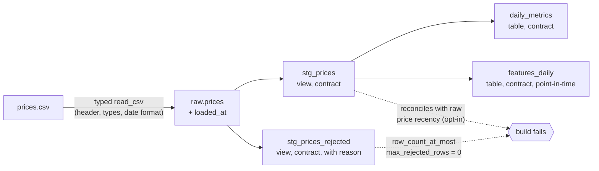

# market-elt: a DuckDB + dbt ELT pipeline with contracts, quality gates and point-in-time features

[](https://github.com/Rodrigo-Palma/market-elt/actions/workflows/ci.yml)
[](https://rodrigo-palma.github.io/market-elt/)
[](https://www.python.org/)
[](https://github.com/duckdb/dbt-duckdb)
[](LICENSE)

Daily close prices go in as a CSV. Out come typed staging tables, a per-ticker
summary and a point-in-time feature table that a model can train on without
look-ahead. Bad input fails the run loudly, every run is logged, and it all
runs offline with one command.

**What is proven, not just claimed:**

- Each quality gate is fed the bad input it exists for and is **seen failing
  on the expected node** (duplicate key, null, NaN, infinite or negative
  close, blank or null ticker, wrong type, wrong header, wrong date format,
  stale prices, stale load).
- Each gate is also broken on purpose, and its test goes red: `make mutate`
  applies **9 mutations** to a copy of the repo and catches all 9.
- The volatility math is checked by a dbt unit test against an **independent
  stdlib reference**. Swapping `sqrt(252)` for `sqrt(365)` fails it.
- The features are **causal**: built on history truncated at T, they match
  the full build on every date up to T. A centered window fails the test,
  and on a random walk that same window buys **7 points of fake accuracy**
  (57.1% vs 50.2%), which is what the test protects a model from.

[Browse the models, columns, tests and lineage graph](https://rodrigo-palma.github.io/market-elt/) (dbt docs, rebuilt on every push).

## Run it

```bash
git clone https://github.com/Rodrigo-Palma/market-elt.git && cd market-elt
make install    # uv sync --locked --extra dev
make pipeline   # load -> dbt build -> one row in meta.pipeline_runs
```

Or with nothing but Docker:

```bash
make docker-run # docker build + docker run, exits non-zero if any gate fails
```

Each run prints JSON log lines and ends with a summary like this one, trimmed to the key fields
(from `make pipeline` on the bundled sample):

```json
{"event": "run.finished", "rows_loaded": 15, "rows_rejected": 0, "dbt_status": "success", "n_pass": 25, "n_fail": 0, "failed_nodes": []}
```

The bundled sample (`data/sample/prices.csv`) holds 15 illustrative prices
for three B3 tickers. They are not market data (they do not match the actual
B3 closes for those dates) and only exercise the mechanics.

## Pipeline



| Model | Grain | Purpose |
|---|---|---|
| `stg_prices` | ticker, price_date | Typed prices that pass every row-level rule |
| `stg_prices_rejected` | ticker, price_date | The other rows, with `reject_reason`. Any row here fails the build by default |
| `daily_metrics` | ticker | Observations, last close, annualized volatility |
| `features_daily` | ticker, price_date | `return_1d`, `rolling_vol_20d`, `rolling_mean_return_20d`, `n_obs_window`, as of the close of each date |
| `meta.pipeline_runs` | run | run_id, timings, rows loaded and rejected, dbt status and node counts. Failed loads (`load_failed`) and dbt crashes (`crashed`) are recorded too |

## Results

All numbers below come from commands in this repo; nothing is estimated.

### Quality gates, each seen failing

From `tests/test_quality_gates.py` and `tests/test_ingest.py`. Every case
asserts a non-zero exit and the name of the failing node, read from dbt's
`run_results.json` (or `sources.json` for freshness).

| Bad input | Stopped by | Where |
|---|---|---|
| Same (ticker, date) twice | `unique_combination_of_columns_stg_prices_ticker__price_date` | dbt test |
| Empty close | `row_count_at_most_stg_prices_rejected__...`, row kept with `null_close` | dbt test |
| Close of -1.00 | same gate, row kept with `non_positive_close` | dbt test |
| `nan` or `inf` in close (valid DOUBLE values) | same gate, rows kept with `nan_close` / `infinite_close` | dbt test |
| Ticker made only of spaces | same gate, row kept with `blank_ticker` | dbt test |
| A rule that drops rows silently | `assert_staging_reconciles_with_raw`: raw = valid + rejected | dbt test |
| Empty ticker | `source_not_null_raw_prices_ticker` | dbt source test |
| `n/a` in close, `06/01/2026` as date, renamed header | `ContractViolationError`, previous table kept | loader |
| Latest price 4 days before `--as-of`, with `--max-price-age-days 3` | `max_date_at_most_days_old` on `stg_prices` (2 days old passes) | dbt test, opt-in |
| `loaded_at` 96 hours old | freshness of `raw.prices` (1 hour old passes) | dbt source freshness |
| Model column type drifts from its contract | contract check, for example `INTEGER` vs `BIGINT` on `observations` | dbt contract |

Two of those need a caveat. Source freshness reads `loaded_at`, which the
loader sets to now(), so right after `market-elt run` it cannot fail, and a
fresh load of months-old prices passes it. It only means something when dbt
runs on its own schedule, apart from the load, so CI no longer runs it after
the pipeline. The recency test measures the prices themselves and catches
that case, but it is off by default because the bundled sample is a fixed
file; turn it on with `--max-price-age-days N` (and `--as-of` to pin the
reference date).

Each gate is also checked from the other side. `make mutate`
([`scripts/mutations.py`](scripts/mutations.py)) copies the repo to a
temporary directory, checks the target tests pass unmutated, applies one
mutation at a time and requires the tests to fail with the expected node in
the output. Last run: 9 of 9 caught. It also runs on demand in the
`Mutations` workflow.

| Mutation | Caught by |
|---|---|
| Drop the `(ticker, price_date)` uniqueness test | duplicate-key gate case |
| Remove the NaN rule | `nan_close` gate case |
| Remove the blank-ticker rule | `blank_ticker` gate case |
| `stg_prices_rejected` drops null closes | `assert_staging_reconciles_with_raw` |
| `sqrt(365)` instead of `sqrt(252)` | dbt unit test against the stdlib reference |
| Window `10 preceding and 9 following` | causal invariance test |
| `cast(count(*) as integer)` in `daily_metrics` | enforced contract |
| Recency threshold ignored | recency gate cases |
| dbt exit code ignored when the artifact says success | `nonzero_exit` pipeline test |

### Sample run

`make pipeline` on the bundled sample (3 tickers x 5 days): 15 rows loaded,
0 rejected, 25 dbt nodes passed (4 models, 20 data tests, 1 unit test), 0
failed. Wall time 2.09 to 2.17 s over 3 runs of `uv run market-elt run` on an
Apple M3 Max, of which dbt reported 0.34 to 0.35 s of execution. With 5
prices per ticker the volatility rests on 4 returns: the sample shows the
mechanics, not a market estimate.

### Scale (synthetic data)

`make bench` writes fixed-seed **synthetic** prices (geometric random walks,
tickers `SYN0000...`, not market data) and times load plus the full
`dbt build`, including every test:

| Rows (synthetic) | Tickers x days | Load (s) | dbt build wall (s) | dbt build exec (s) | Nodes passed |
|---:|---:|---:|---:|---:|---:|
| 10,000 | 10 x 1000 | 0.011 | 1.472 | 0.382 | 25 |
| 100,000 | 100 x 1000 | 0.039 | 1.503 | 0.411 | 25 |
| 1,000,000 | 1000 x 1000 | 0.123 | 1.814 | 0.708 | 25 |
| 10,000,000 | 10000 x 1000 | 0.364 | 3.290 | 2.152 | 25 |

Median of 3 runs on Apple M3 Max, Darwin 27.0.0; python 3.12.13, duckdb 1.5.4,
dbt-core 1.11.11, dbt-duckdb 1.10.1. Seed 20260101. Raw output in
[`benchmarks/results.md`](benchmarks/results.md).

Reading it honestly: up to a million rows, dbt's fixed cost (wall minus exec,
about 1.1 s) dominates. Between 1e6 and 1e7 rows execution overtakes it: at
1e7 dbt executes for 2.15 s of a 3.29 s build. 1e8 rows was not measured.
These runs say nothing about data that does not fit on one machine.

Turning off dbt's anonymous usage tracking (`send_anonymous_usage_stats:
false`) cut the 1e4 build from 2.19 s to 1.61 s (median of 5 runs each, same
machine and network), which is why this table is faster than the one in
v0.2.0.

### What point-in-time buys a model

`make leakage` ([`benchmarks/leakage.py`](benchmarks/leakage.py)) builds the
pipeline on synthetic random walks, where tomorrow's return is independent
of the past by construction, and fits the same one-parameter rule (sign of
the 20-row mean return predicts the sign of the next return, direction
chosen on the train dates) twice: on `rolling_mean_return_20d` from
`features_daily`, and on a centered 20-row mean, the window the causal test
rejects. The split is by date, test strictly after train.

| Feature | Rule (fit on train) | Train accuracy | Test accuracy | 95% Wilson | n test |
|---|---|---:|---:|---:|---:|
| point_in_time | reversal | 50.29% | 50.18% | 49.77% to 50.58% | 58,798 |
| leaky | momentum | 56.81% | 57.10% | 56.70% to 57.50% | 58,798 |

200 tickers x 1000 weekdays, seed 20260102. The point-in-time interval
covers 50%, as it must when there is no signal. The leaky window holds the
label among its 20 returns, a correlation of about 1/sqrt(20) = 0.22, and
0.5 + arcsin(0.22)/pi = 57.2% is what it scores. A backtest on that
feature would report an edge that cannot exist live.

### Test suite

64 pytest tests, 99% line coverage (98.98%) with a 95% floor enforced in CI.
CI also runs ruff, mypy (strict on untyped defs), the pipeline and the Docker
image end to end; the mutation check runs on demand.

## Design decisions

- [ADR 0001](docs/adr/0001-duckdb-local-warehouse.md): DuckDB as a local, file-based warehouse
- [ADR 0002](docs/adr/0002-contracts-and-explicit-rejection.md): typed contracts at every boundary, and explicit rejection instead of silent filters
- [ADR 0003](docs/adr/0003-point-in-time-features.md): point-in-time features with a causal invariance test

## Commands

```bash
make lint          # ruff
make type          # mypy
make test          # pytest: unit, gates, causal invariance, end to end
make pipeline      # market-elt run
make freshness     # dbt source freshness on raw.prices (useful when dbt runs apart from the load)
make docs          # dbt docs as one static HTML page
make bench         # scale benchmark on synthetic data
make leakage       # point-in-time vs leaky feature on synthetic random walks
make mutate        # break each gate in a temp copy, require its test to fail
make docker-run    # the pipeline inside the image

uv run market-elt run --csv path/to/prices.csv --max-rejected-rows 5
uv run market-elt run --csv path/to/prices.csv --max-price-age-days 4
```

## Layout

```
src/market_elt/      loader with the CSV contract, dbt runner, pipeline, CLI, JSON logs
transform/           dbt project: models, contracts, generic tests, unit test, macro
tests/               pytest, with one broken fixture per quality gate
scripts/             reference for the daily_metrics unit test, mutation check
benchmarks/          synthetic scale and leakage benchmarks, with their results
docs/adr/            architecture decision records
```

## License

MIT, see [LICENSE](LICENSE).

## Author

Rodrigo Stachlewski Palma ([GitHub](https://github.com/Rodrigo-Palma))
