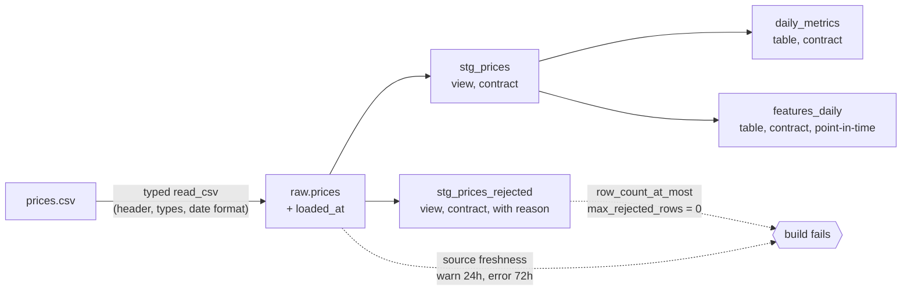

# market-elt: a DuckDB + dbt ELT pipeline with contracts, quality gates and point-in-time features

[](https://github.com/Rodrigo-Palma/market-elt/actions/workflows/ci.yml)
[](https://rodrigo-palma.github.io/market-elt/)
[](https://www.python.org/)
[](https://github.com/duckdb/dbt-duckdb)
[](LICENSE)

Daily close prices go in as a CSV. Out come typed staging tables, a per-ticker
summary and a point-in-time feature table that a model can train on without
look-ahead. Bad input fails the run loudly, every run is logged, and it all
runs offline with one command.

**What is proven, not just claimed:**

- Each quality gate is fed the bad input it exists for and is **seen failing
  on the expected node** (duplicate key, null close, negative close, null
  ticker, wrong type, wrong header, wrong date format, stale load).
- The volatility math is checked by a dbt unit test against an **independent
  stdlib reference**. Swapping `sqrt(252)` for `sqrt(365)` fails it.
- The features are **causal**: built on history truncated at T, they match
  the full build on every date up to T. A centered window fails the test.

[Browse the models, columns, tests and lineage graph](https://rodrigo-palma.github.io/market-elt/) (dbt docs, rebuilt on every push).

## Run it

```bash
git clone https://github.com/Rodrigo-Palma/market-elt.git && cd market-elt
make install    # uv sync --locked --extra dev
make pipeline   # load -> dbt build -> one row in meta.pipeline_runs
```

Or with nothing but Docker:

```bash
make docker-run # docker build + docker run, exits non-zero if any gate fails
```

Each run prints JSON log lines and ends with a summary like this one, trimmed to the key fields
(from `make pipeline` on the bundled sample):

```json
{"event": "run.finished", "rows_loaded": 15, "rows_rejected": 0, "dbt_status": "success", "n_pass": 24, "n_fail": 0, "failed_nodes": []}
```

## Pipeline



| Model | Grain | Purpose |
|---|---|---|
| `stg_prices` | ticker, price_date | Typed prices that pass every row-level rule |
| `stg_prices_rejected` | ticker, price_date | The other rows, with `reject_reason`. Any row here fails the build by default |
| `daily_metrics` | ticker | Observations, last close, annualized volatility |
| `features_daily` | ticker, price_date | `return_1d`, `rolling_vol_20d`, `rolling_mean_return_20d`, `n_obs_window`, as of the close of each date |
| `meta.pipeline_runs` | run | run_id, timings, rows loaded and rejected, dbt status and node counts |

## Results

All numbers below come from commands in this repo; nothing is estimated.

### Quality gates, each seen failing

From `tests/test_quality_gates.py` and `tests/test_ingest.py`. Every case
asserts a non-zero exit and the name of the failing node, read from dbt's
`run_results.json` (or `sources.json` for freshness).

| Bad input | Stopped by | Where |
|---|---|---|
| Same (ticker, date) twice | `unique_combination_of_columns_stg_prices_ticker__price_date` | dbt test |
| Empty close | `row_count_at_most_stg_prices_rejected__...`, row kept with `null_close` | dbt test |
| Close of -1.00 | same gate, row kept with `non_positive_close` | dbt test |
| Empty ticker | `source_not_null_raw_prices_ticker` | dbt source test |
| `n/a` in close, `06/01/2026` as date, renamed header | `ContractViolationError`, previous table kept | loader |
| `loaded_at` 96 hours old | freshness of `raw.prices` (1 hour old passes) | dbt source freshness |
| Model column type drifts from its contract | contract check, for example `INTEGER` vs `BIGINT` on `observations` | dbt contract |

Each gate was also checked from the other side, once, by mutating the code
and watching a test go red (recorded in the commit messages):

| Mutation | What failed |
|---|---|
| Drop the `(ticker, price_date)` uniqueness test | duplicate-key case: `dbt build` exited 0 with PASS=15 |
| `sqrt(365)` instead of `sqrt(252)` | unit test: 0.5461422585 instead of 0.4537949098 |
| Window `10 preceding and 9 following` | causal invariance test, both cut dates |
| `cast(count(*) as integer)` in `daily_metrics` | contract mismatch, build ERROR=1 |

### Sample run

`make pipeline` on the bundled sample (3 tickers x 5 days): 15 rows loaded,
0 rejected, 24 dbt nodes passed (4 models, 19 data tests, 1 unit test), 0
failed. Wall time 2.55 to 4.44 s over 3 runs on an Apple M3 Max, of which dbt
reported 0.45 s of execution. With 5 prices per ticker the volatility rests on
4 returns: the sample shows the mechanics, not a market estimate.

### Scale (synthetic data)

`make bench` writes fixed-seed **synthetic** prices (geometric random walks,
tickers `SYN0000...`, not market data) and times load plus the full
`dbt build`, including every test:

| Rows (synthetic) | Tickers x days | Load (s) | dbt build wall (s) | dbt build exec (s) | Nodes passed |
|---:|---:|---:|---:|---:|---:|
| 10,000 | 10 x 1000 | 0.013 | 2.722 | 0.420 | 24 |
| 100,000 | 100 x 1000 | 0.042 | 2.448 | 0.465 | 24 |
| 1,000,000 | 1000 x 1000 | 0.124 | 2.605 | 0.716 | 24 |

Median of 3 runs on Apple M3 Max, Darwin 27.0.0; python 3.12.13, duckdb 1.5.4,
dbt-core 1.11.11, dbt-duckdb 1.10.1. Seed 20260101. Raw output in
[`benchmarks/results.md`](benchmarks/results.md).

Reading it honestly: up to a million rows, dbt start-up (about 2 s) dominates
the wall time, and execution grows from 0.42 s to 0.72 s. These runs say
nothing about data that does not fit on one machine.

### Test suite

47 pytest tests, 98% line coverage with a 95% floor enforced in CI. CI also
runs ruff, mypy (strict on untyped defs), the pipeline, source freshness, and
the Docker image end to end.

## Design decisions

- [ADR 0001](docs/adr/0001-duckdb-local-warehouse.md): DuckDB as a local, file-based warehouse
- [ADR 0002](docs/adr/0002-contracts-and-explicit-rejection.md): typed contracts at every boundary, and explicit rejection instead of silent filters
- [ADR 0003](docs/adr/0003-point-in-time-features.md): point-in-time features with a causal invariance test

## Commands

```bash
make lint          # ruff
make type          # mypy
make test          # pytest: unit, gates, causal invariance, end to end
make pipeline      # market-elt run
make freshness     # dbt source freshness on raw.prices
make docs          # dbt docs as one static HTML page
make bench         # scale benchmark on synthetic data
make docker-run    # the pipeline inside the image

uv run market-elt run --csv path/to/prices.csv --max-rejected-rows 5
```

## Layout

```
src/market_elt/      loader with the CSV contract, dbt runner, pipeline, CLI, JSON logs
transform/           dbt project: models, contracts, generic tests, unit test, macro
tests/               pytest, with one broken fixture per quality gate
scripts/             independent reference for the daily_metrics unit test
benchmarks/          synthetic scale benchmark and its results
docs/adr/            architecture decision records
```

## License

MIT, see [LICENSE](LICENSE).

## Author

**Rodrigo Stachlewski Palma**, Senior Data & AI Engineer.
[LinkedIn](https://linkedin.com/in/rodrigospalma/) · [GitHub](https://github.com/Rodrigo-Palma)
